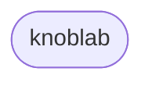

# knoblab

> Personal development namespace and experimental laboratory for web engineering.

---

## Overview
`knoblab`은 개인 웹 개발 프로젝트를 통합하고 기록하기 위한 네임스페이스이자 활동명입니다.

## Core History
**PDF-DS (Web Design System)**
`knoblab`의 첫 프로젝트입니다. 웹 애플리케이션의 일관된 UI/UX 환경과 재사용 가능한 컴포넌트 아키텍처를 설계하기 위해 구축한 자체 웹 디자인 시스템입니다.

## Projects & Experiments

- `PDF-DS` : Core Web Design System [(https://img.shields.io/badge/Repository-232B2B?style=flat-square&logo=github&logoColor=white)](https://pdf-ds.qpi.digital/)

## Contact
- GitHub: [@knoblab](https://github.com/knoblab)
- Web: 준비중
